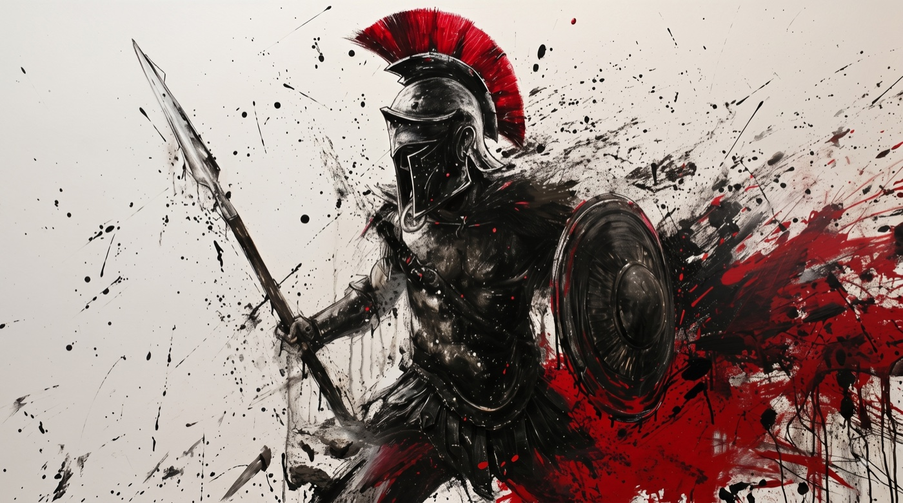

  

<h1 align="center">Mahmoud Al-Sadder</h1>

  AI &amp; Cybersecurity Engineer 
  Intelligent, secure systems for governments and industry across MENA

  
  
  
  

<code>ΜΟΛΩΝ ΛΑΒΕ</code>

 

## Battle Log

<!--START:BATTLE_LOG-->

  
  
  
  

| | Commits | PRs opened | PRs merged | Issues closed | Repos |
| :--- | ---: | ---: | ---: | ---: | ---: |
| **This week** | 0 | 0 | 0 | 0 | 0 |
| **This month** | 291 | 74 | 74 | 53 | 7 |
| **Last 12 months** | 1,488 | 436 | 421 | 203 | 11 |

<!--END:BATTLE_LOG-->

 

## Arsenal

  
  
  
  
  

  
  
  
  

---

  

  Selected projects and case studies at <a href="https://mahmoudsadder.me">mahmoudsadder.me</a>

